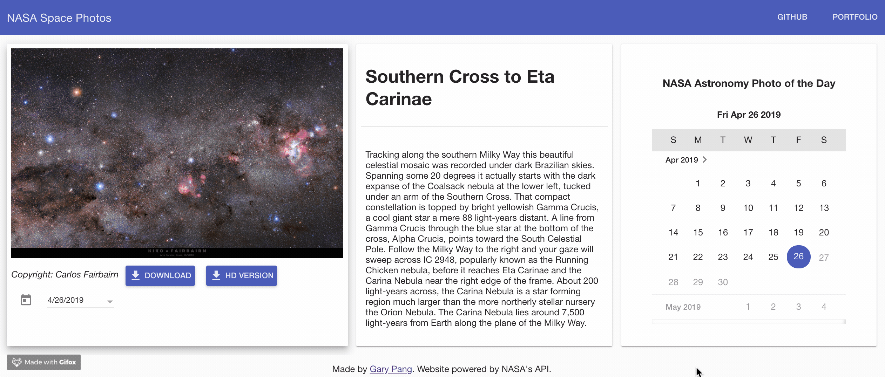

# NASA APOD Photo Gallery
This repository contains the source for an AngularJS application for viewing images in NASA's Astronomy Picture of the Day (APOD) series. The application provides users with a calendar interface for finding the captioned images by date, and downloading each image or its HD version. Users can also watch any video that NASA uploaded as its "Picture of the Day." The application retrieves images and videos via the space agency's API.

## Requirements

#### External API Key

- This project makes use of NASA's APOD API to access images and videos. To get an API key, visit: https://api.nasa.gov/index.html#apply-for-an-api-key

#### Key Dependencies

- [Node.js](https://nodejs.org/en/) with [Express.js](https://expressjs.com/) web framework
- [AngularJS](https://angularjs.org/) web framework
- [Angular Material](https://material.angular.io/) components for Angular
- [Material Icons](https://fonts.googleapis.com/icon?family=Material+Icons) style sheet

## Author
**Gary Pang** - [codewritingcow.com](http://codewritingcow.com)

## References
- [NASA APOD API documentation](https://api.nasa.gov/api.html#apod)
